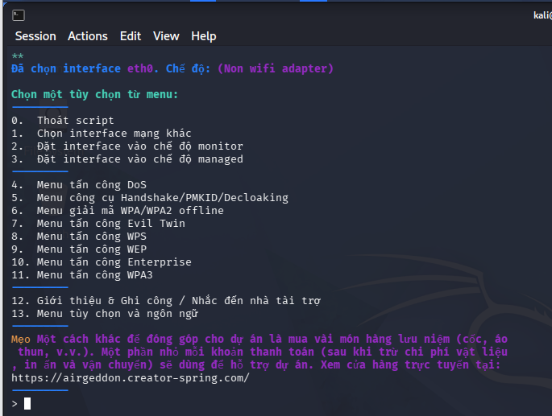

# AIRGEDDON - Hướng Dẫn Sử Dụng Tiếng Việt

> **⚠️ CẢNH BÁO: Chỉ sử dụng cho mục đích học tập và nghiên cứu trên mạng không dây của riêng bạn.**

---

## 📋 Mục Lục

1. [Giới thiệu](#giới-thiệu)
2. [Yêu cầu hệ thống](#yêu-cầu-hệ-thống)
3. **[Hướng dẫn tải và chạy chi tiết](#hướng-dẫn-tải-và-chạy-chi-tiết)**
4. [Cài đặt](#cài-đặt)
5. [Hướng dẫn sử dụng](#hướng-dẫn-sử-dụng)
6. [Các tính năng chính](#các-tính-năng-chính)
7. [Nhắc nhở khi sử dụng](#nhắc-nhở-khi-sử-dụng)
8. [Mục đích học tập](#mục-đích-học-tập)
9. [Giải quyết sự cố](#giải-quyết-sự-cố)

---

## Giới Thiệu

**Airgeddon** là một công cụ audit mạng không dây mã nguồn mở, được viết bằng Bash, chạy trên hệ điều hành Linux. Công cụ này giúp:

- Quét và phát hiện mạng không dây
- Phân tích bảo mật các mạng WiFi
- Thực hiện các bài kiểm tra tấn công khác nhau
- Hỗ trợ nhiều giao thức: WPA, WPA2, WPA3, WEP, WPS

**Phiên bản hiện tại:** 12.01

### 📸 Giao diện tiếng Việt



*Giao diện airgeddon đã được dịch sang tiếng Việt - Dễ sử dụng cho người Việt Nam*

---

## Yêu Cầu Hệ Thống

### Hệ điều hành
- Linux (Kali, Parrot, Ubuntu, Debian, Mint, v.v.)
- Docker cũng được hỗ trợ

### Phần cứng
- Card WiFi hỗ trợ chế độ monitor (khuyên dùng: Alfa AWUS036ACH)
- Tối thiểu 2GB RAM
- 1GB dung lượng trống

### Công cụ cần thiết (tự động cài đặt)
- `iw` - Quản lý giao diện WiFi
- `awk` - Xử lý văn bản
- `airmon-ng` - Bật/tắt chế độ monitor
- `airodump-ng` - Quét mạng WiFi
- `aircrack-ng` - Cracking mật khẩu
- `xterm` - Terminal giả lập

### Công cụ tùy chọn (khuyến khích cài đặt)
- `hashcat` - Cracking nâng cao (GPU)
- `reaver` / `bully` - Tấn công WPS
- `bettercap` - MITM attack
- `beef` - Browser exploitation
- `john` - Password cracking
- `hcxtools` - WPA enterprise

---

## 📥 Hướng Dẫn Tải Và Chạy Chi Tiết

### 🔧 LỆNH CÀI ĐẶT TỪNG BƯỚC

**Mở terminal:** `Ctrl + Alt + T`

---

### Bước 1: Cài công cụ cần thiết
```bash
sudo apt update && sudo apt upgrade -y
sudo apt install -y git aircrack-ng iw xterm hashcat reaver bully pixiewps bettercap john hcxtools hcxdumptool
```

---

### Bước 2: Tải airgeddon
```bash
cd ~
git clone https://github.com/v1s1t0r1sh3r3/airgeddon.git
```

---

### Bước 3: Vào thư mục và chạy
```bash
cd ~/airgeddon-vietnamese
sudo bash airgeddon.sh
```

---

### 🚀 LỆNH CHẠY NHANH (copy-paste)
```bash
# Tải + cài + chạy trong 1 lệnh
sudo apt update && sudo apt install -y git aircrack-ng iw xterm && cd ~ && git clone https://github.com/thanhtai21/airgeddon-vietnamese.git && cd ~/airgeddon-vietnamese && sudo bash airgeddon.sh
```

---

### 📋 TÓM TẮT LỆNH QUAN TRỌNG

| Lệnh | Mục đích |
|-------|----------|
| `sudo apt update` | Cập nhật danh sách package |
| `sudo apt install aircrack-ng` | Cài aircrack-ng |
| `git clone ...` | Tải airgeddon từ GitHub |
| `cd ~/airgeddon` | Vào thư mục airgeddon |
| `sudo bash airgeddon.sh` | Chạy airgeddon |
| `sudo airmon-ng start wlan0` | Bật chế độ monitor |
| `sudo airmon-ng check kill` | Tắt process gây nhiễu |
| `iwconfig` | Kiểm tra chế độ WiFi |
| `aircrack-ng -w rockyou.txt file.cap` | Crack mật khẩu |

---

### 🔄 SAU KHI CÀI XONG - MỖI LẦN SỬ DỤNG

```bash
# Cách 1: Vào thư mục rồi chạy
cd ~/airgeddon-vietnamese
sudo bash airgeddon.sh

# Cách 2: Chạy trực tiếp (không cần cd)
sudo bash ~/airgeddon-vietnamese/airgeddon.sh
```

---

### ⚠️ LƯU Ý QUAN TRỌNG

```bash
# PHẢI chạy với sudo (quyền root)
sudo bash airgeddon.sh

# Nếu lỗi "permission denied":
chmod +x airgeddon.sh
sudo bash airgeddon.sh
```

---

## Chi tiết từng bước (nâng cao)

#### Cách A: Dùng máy ảo (khuyên dùng cho người mới)
```
1. Tải VirtualBox: https://www.virtualbox.org/
2. Tải Kali Linux: https://www.kali.org/get-kali/
   - Chọn "VirtualBox" hoặc "VMware"
3. Tạo máy ảo mới:
   - RAM: 4GB tối thiểu
   - HDD: 20GB
   - CPU: 2 cores
4. Cài đặt Kali vào máy ảo
```

#### Cách B: Cài dual boot
```
1. Download Kali Linux ISO
2. Tạo USB boot bằng Rufus: https://rufus.ie/
3. Boot từ USB và cài đặt
```

#### Cách C: Docker (nếu đã có Docker)
```bash
# Cài Docker trên Ubuntu/Debian
sudo apt update
sudo apt install docker.io
sudo systemctl start docker
sudo systemctl enable docker

# Thêm user vào nhóm docker
sudo usermod -aG docker $USER
# Đăng nhập lại để có hiệu lực
```

---

### Bước 2: Tải Airgeddon

#### Cách 1: Clone từ GitHub (khuyên dùng)
```bash
# Mở terminal (Ctrl+Alt+T)

# Cài git nếu chưa có
sudo apt update
sudo apt install git

# Clone kho airgeddon (bản tiếng Việt)
git clone https://github.com/thanhtai21/airgeddon-vietnamese.git

# Vào thư mục airgeddon
cd airgeddon-vietnamese

# Xem danh sách file
ls -la
```

#### Cách 2: Tải file trực tiếp (nhanh nhất)
```bash
# Tải wget
sudo apt install wget

# Tải file airgeddon.sh
wget https://raw.githubusercontent.com/thanhtai21/airgeddon-vietnamese/main/airgeddon.sh

# Tải file ngôn ngữ
wget https://raw.githubusercontent.com/thanhtai21/airgeddon-vietnamese/main/language_strings.sh

# Tải database PIN
wget https://raw.githubusercontent.com/thanhtai21/airgeddon-vietnamese/main/known_pins.db
wget https://raw.githubusercontent.com/thanhtai21/airgeddon-vietnamese/main/pindb_checksum.txt
```

#### Cách 3: Download ZIP từ GitHub
```
1. Vào: https://github.com/thanhtai21/airgeddon-vietnamese
2. Nhấn nút "Code" (màu xanh lá)
3. Chọn "Download ZIP"
4. Giải nén file ZIP
5. Mở terminal vào thư mục đã giải nén
```

---

### Bước 3: Cài đặt công cụ cần thiết

```bash
# Cập nhật hệ thống
sudo apt update && sudo apt upgrade -y

# Cài đặt các công cụ cơ bản
sudo apt install -y \
  aircrack-ng \
  iw \
  awk \
  xterm \
  net-tools \
  pciutils \
  procps

# Cài đặt công cụ tùy chọn (khuyến khích)
sudo apt install -y \
  hashcat \
  reaver \
  bully \
  pixiewps \
  bettercap \
  beef-xss \
  john \
  nmap \
  hcxtools \
  hcxdumptool

# Cài đặt wordlist cho cracking
sudo apt install -y wordlists
# Hoặc tải rockyou.txt
sudo gunzip /usr/share/wordlists/rockyou.txt.gz
```

---

### Bước 4: Chuẩn bị card WiFi

#### Kiểm tra card WiFi hiện tại
```bash
# Xem danh sách card WiFi
iwconfig

# Hoặc dùng
ip link show

# Ví dụ output:
# wlan0     IEEE 802.11  ESSID:off/any
#           Mode:Managed  Tx-Power=20 dBm
```

#### Kiểm tra hỗ trợ Monitor Mode
```bash
# Kiểm tra chipset
sudo airmon-ng

# Output sẽ hiển thị:
# PHY     Interface   Driver      Chipset
# phy0    wlan0       ath9k       Qualcomm Atheros
```

#### Chuyển sang Monitor Mode
```bash
# Tắt các process gây nhiễu
sudo airmon-ng check kill

# Bật chế độ monitor
sudo airmon-ng start wlan0

# Kiểm tra đã chuyển thành công chưa
iwconfig
# sẽ thấy: Mode:Monitor
```

---

### Bước 5: Chạy Airgeddon

#### Cách chạy cơ bản
```bash
# Vào thư mục airgeddon
cd airgeddon

# Chạy với quyền root (BẮT BUỘC)
sudo bash airgeddon.sh
```

#### Cách chạy với tùy chọn
```bash
# Chạy với ngôn ngữ cụ thể
sudo bash airgeddon.sh --language EN

# Chạy với giao diện cụ thể
sudo bash airgeddon.sh --interface wlan0

# Chạy với debug mode
sudo bash airgeddon.sh --debug
```

#### Khi chạy thành công sẽ thấy:
```
*****************************************************************
*     █████╗  █████╗ ██╗   ██╗██████╗ ██╗ ██████╗██████╗ ██╗  *
*    ██╔════╝ ██╔══██╗██║   ██║██╔══██╗██║██╔════╝██╔══██╗██║ *
*    ███████╗ ███████║██║   ██║██████╔╝██║██║     ██████╔╝██║ *
*    ██╔═══╝  ██╔══██║██║   ██║██╔══██╗██║██║     ██╔══██╗╚═╝ *
*    ╚██████╗ ██║  ██║╚██████╔╝██║  ██║██║╚██████╗██║  ██║██╗*
*     ╚═════╝ ╚═╝  ╚═╝ ╚═════╝ ╚═╝  ╚═╝╚═╝ ╚═════╝╚═╝  ╚═╝╚═╝*
*                                                                 *
*    v12.01                                                        *
*****************************************************************

[!] THÔNG BÁO QUAN TRỌNG:
[!] Công cụ này CHỈ nên được sử dụng cho mục đích giáo dục
[!] và nghiên cứu bảo mật hợp pháp.

Nhấn [Enter] để tiếp tục...
```

---

### Bước 6: Sử dụng Airgeddon (Tóm tắt nhanh)

#### Menu chính:
```
[0]  Quét mạng WiFi (airodump-ng)
[1]  Chọn giao diện WiFi
[2]  Chế độ monitor
[3]  Tấn công WPA/WPA2
[4]  Tấn công WPS
[5]  Tấn công WEP
[6]  Evil Twin
[7]  Tấn công MITM
[8]  Công cụ khác
...
[q]  Thoát
```

#### Quy trình sử dụng cơ bản:
```
1. Nhấn [0] để quét mạng
2. Chọn giao diện WiFi
3. Nhấn [1] để chọn giao diện
4. Nhấn [2] để bật chế độ monitor
5. Quay lại quét, chọn mạng mục tiêu
6. Chọn loại tấn công
7. Làm theo hướng dẫn
8. Xem kết quả trong thư mục airgeddon_results/
```

---

### Bước 7: Xem kết quả

```bash
# Thư mục kết quả
cd airgeddon_results/

# Xem các file kết quả
ls -la

# Các file quan trọng:
# - handshake-01.cap    : File handshake bắt được
# - pmkid_hash.txt      : Hash PMKID
# - *.pot               : Mật khẩu đã crack được
```

#### Cracking mật khẩu (sau khi bắt được handshake)
```bash
# Sử dụng aircrack-ng
aircrack-ng -w /usr/share/wordlists/rockyou.txt handshake-01.cap

# Sử dụng hashcat (nhanh hơn)
hashcat -m 22000 handshake.hc22000 /usr/share/wordlists/rockyou.txt
```

---

## Cài Đặt (Chi tiết hơn)

### Cách 1: Clone từ GitHub
```bash
git clone https://github.com/v1s1t0r1sh3r3/airgeddon.git
cd airgeddon
sudo bash airgeddon.sh
```

### Cách 2: Docker
```bash
docker pull v1s1t0r1sh3r3/airgeddon
docker run -it --net=host --privileged -v /dev:/dev v1s1t0r1sh3r3/airgeddon
```

### Cách 3: Tải trực tiếp
```bash
wget https://raw.githubusercontent.com/v1s1t0r1sh3r3/airgeddon/master/airgeddon.sh
chmod +x airgeddon.sh
sudo bash airgeddon.sh
```

---

## Hướng Dẫn Sử Dụng

### Bước 1: Khởi động
```bash
sudo bash airgeddon.sh
```

### Bước 2: Chọn ngôn ngữ
- Chương trình hỗ trợ: English, Spanish, French, Vietnamese (đang phát triển)
- Nhập số tương ứng để chọn

### Bước 3: Chọn giao diện WiFi
```
[0] wlan0 - Qualcomm Atheros (chế độ: Managed)
[1] wlan1 - Realtek RTL8812AU (chế độ: Monitor)
```
- Chọn giao diện đang ở chế độ **Monitor**
- Nếu chưa có, chọn giao diện và nhấn `a` để chuyển sang chế độ monitor

### Bước 4: Chọn loại tấn công

#### Tấn công WPA/WPA2
| Số | Loại tấn công | Mô tả |
|----|---------------|-------|
| 1 | Deauth attack | Ngắt kết nối client để bắt handshake |
| 2 | Handshake capture | Bắt gói tin 4-way handshake |
| 3 | PMKID attack | Tấn công không cần client |
| 4 | Evil Twin | AP giả mạo với captive portal |

#### Tấn công WPS
| Số | Loại tấn công | Mô tả |
|----|---------------|-------|
| 1 | Pixie Dust | Tấn công nhanh (nếu router bị lỗi) |
| 2 | PIN attack | Thử PIN từ database |
| 3 | Null PIN | Thử PIN mặc định |

#### Tấn công WEP
| Số | Loại tấn công | Mô tả |
|----|---------------|-------|
| 1 | Client attack | Thu thập IV từ client |
| 2 | Fake authentication | Giả lập xác thực |
| 3 | ARP replay | Tái phát ARP để tăng IV |

### Bước 5: Chạy tấn công
- Làm theo hướng dẫn trên màn hình
- Chờ đợi quá trình thu thập dữ liệu
- Kết quả sẽ được lưu trong thư mục `airgeddon_results/`

---

## Các Tính Năng Chính

### 1. Quét mạng
- `airodump-ng` - Quét tất cả mạng WiFi gần
- Hiển thị:SSID, BSSID, Channel, Encryption, Signal

### 2. Bắt Handshake
- Deauth client để bắt 4-way handshake
- Lưu file: `handshake-01.cap`
- Sử dụng với aircrack-ng hoặc hashcat

### 3. Tấn công PMKID
- Không cần client kết nối
- Tấn công trực tiếp vào AP
- Nhanh hơn so với Deauth attack

### 4. Evil Twin
- Tạo AP giả mạo giống mạng mục tiêu
- Captive portal đánh cắp mật khẩu
- Hỗ trợ nhiều giao diện portal

### 5. Tấn công WPS
- Pixie Dust (tấn công nhanh)
- PIN brute-force
- Database PIN (từ cơ sở dữ liệu known_pins.db)

### 6. Cracking mật khẩu
- **aircrack-ng**: CPU-based
- **hashcat**: GPU-based (nhanh hơn 10-100x)
- **john**: Alternative CPU-based

---

## Nhắc Nhở Khi Sử Dụng

### ⚖️ Pháp lý
```
╔══════════════════════════════════════════════════════════════╗
║                    CẢNH BÁO PHÁP LÝ                        ║
╠══════════════════════════════════════════════════════════════╣
║ • Chỉ test trên mạng bạn sở hữu hoặc được phép            ║
║ • Vi phạm có thể bị phạt tiền hoặc tịch thu thiết bị      ║
║ • Luôn có sự đồng ý bằng văn bản từ chủ sở hữu mạng       ║
╚══════════════════════════════════════════════════════════════╝
```

### 🔒 Bảo mật
- Lưu trữ kết quả an toàn
- Xóa dữ liệu sau khi hoàn thành nghiên cứu
- Không chia sẻ thông tin trái phép

### 🎯 Mục đích sử dụng hợp pháp
- ✅ Audit bảo mật mạng của riêng bạn
- ✅ Học tập và nghiên cứu bảo mật
- ✅ Kiểm tra pentest được ủy quyền
- ❌ Tấn công mạng người khác
- ❌ Đánh cắp thông tin
- ❌ Gây hại cho hệ thống

---

## Mục Đích Học Tập

### 1. Học về Protocols
```
WPA2-PSK: 4-way handshake
WPA2-Enterprise: RADIUS authentication
WPS: Wi-Fi Protected Setup
WEP: Wired Equivalent Privacy (cũ, dễ crack)
```

### 2. Học về Tấn công
```
Deauthentication: Ngắt kết nối client
Evil Twin: AP giả mạo
Capture Portal: Trang đăng nhập giả
Brforce: Thử tất cả tổ hợp
Rainbow Table: Bảng hash có sẵn
```

### 3. Học về Bảo mật
```
Chọn mật khẩu mạnh: 12+ ký tự, hỗn hợp
Sử dụng WPA3 nếu có thể
Tắt WPS nếu không cần
Sử dụng 802.1X cho doanh nghiệp
```

### 4. Thực hành
```bash
# Bước 1: Cài đặt lab
# Tạo mạng test với router cũ hoặc virtual AP

# Bước 2: Thực hành quét
sudo bash airgeddon.sh
# Chọn quét mạng, xem kết quả

# Bước 3: Thực hành bắt handshake
# Chọn mạng test -> Deauth -> Bắt handshake

# Bước 4: Cracking
# Sử dụng wordlist phổ biến
aircrack-ng -w /usr/share/wordlists/rockyou.txt handshake.cap
```

### 5. Tài liệu tham khảo
- [OWASP WiFi Security](https://owasp.org/)
- [WiFi Alliance](https://www.wi-fi.org/)
- [Kali Linux Documentation](https://www.kali.org/docs/)

---

## Giải Quyết Sự Cố

### Lỗi: "No interface found"
```bash
# Kiểm tra card WiFi
iwconfig
# Bật chế độ monitor
sudo airmon-ng check kill
sudo airmon-ng start wlan0
```

### Lỗi: "Device or resource busy"
```bash
# Tắt các process sử dụng WiFi
sudo airmon-ng check kill
```

### Lỗi: "Command not found"
```bash
# Cài đặt công cụ cần thiết
sudo apt install aircrack-ng hashcat reaver bully
```

### Lỗi: Không bắt được handshake
```bash
# Thử cách khác:
# 1. Tăng thời gian chờ
# 2. Đổi channel
# 3. Sử dụng PMKID attack thay vì Deauth
```

---

## Liên Hệ

- **GitHub:** https://github.com/v1s1t0r1sh3r3/airgeddon
- **Wiki:** https://github.com/v1s1t0r1sh3r3/airgeddon/wiki
- **Discord:** https://discord.gg/sQ9dgt9

---

**📝 Ghi chú: Đây là bản dịch tiếng Việt để hỗ trợ học tập. Luôn tham khảo tài liệu gốc từ GitHub.**
